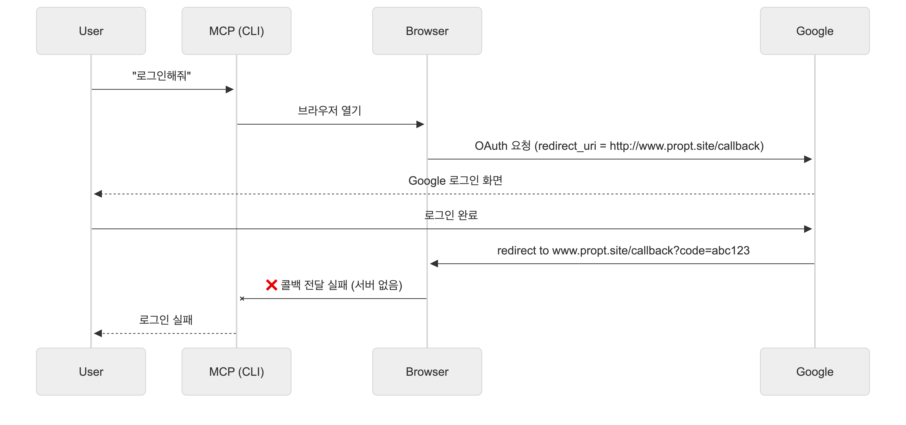
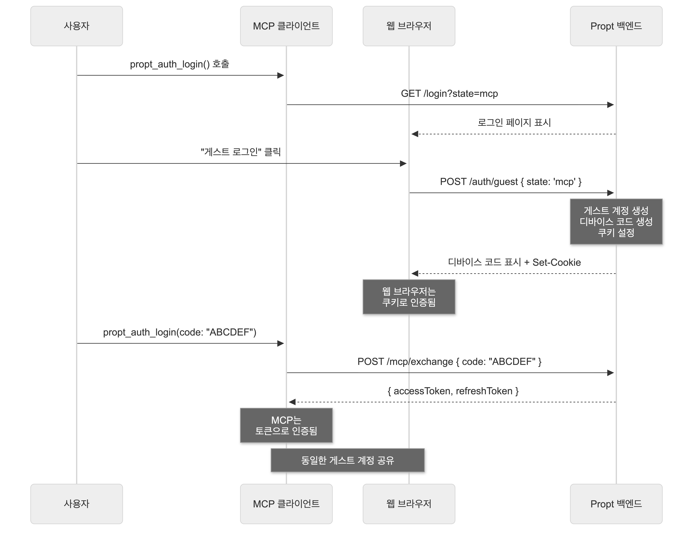
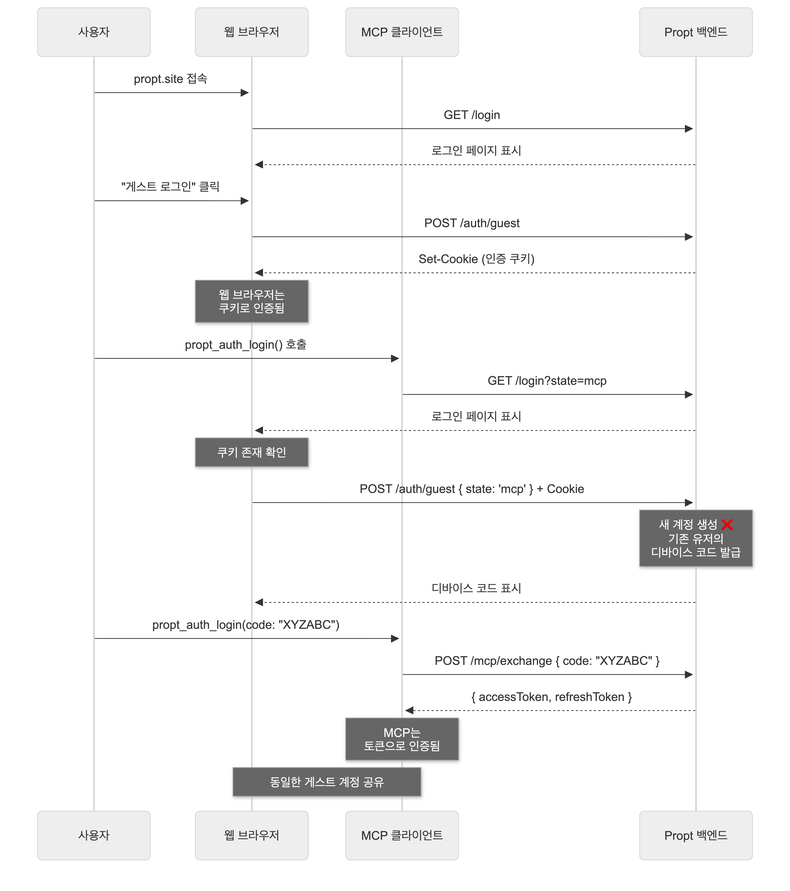
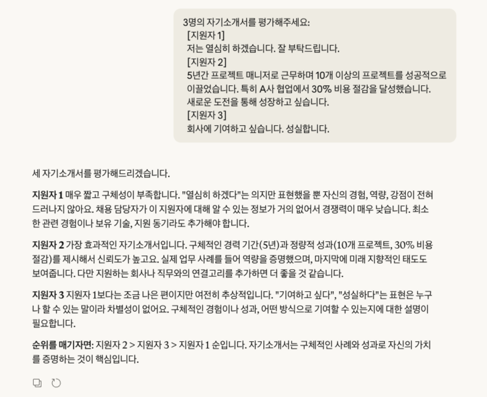
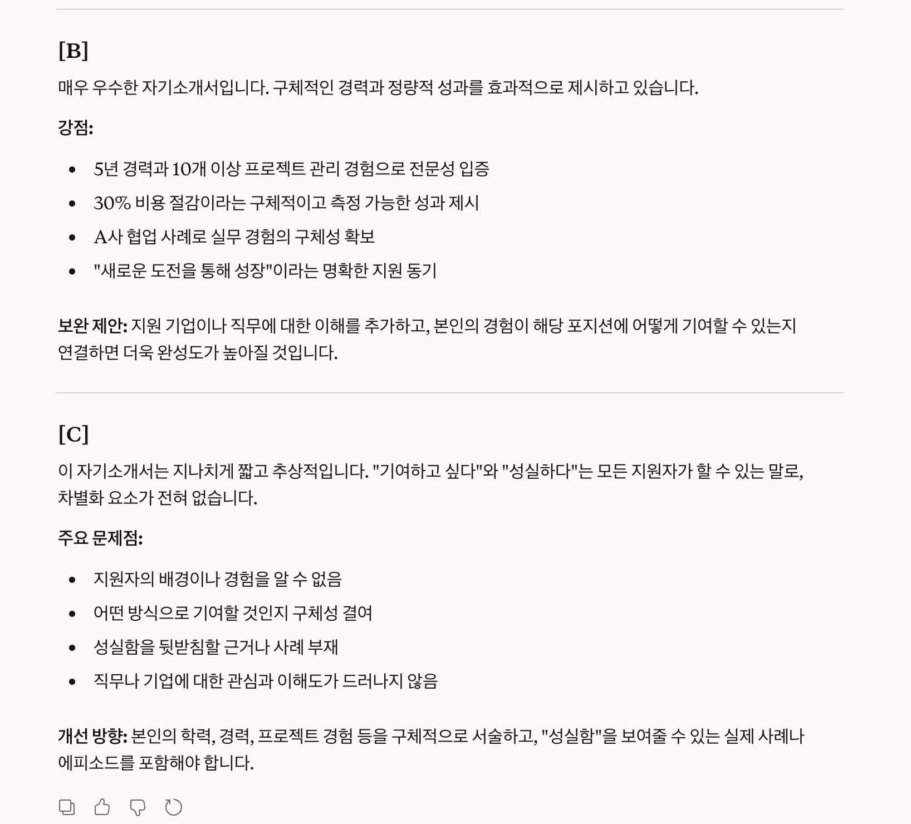
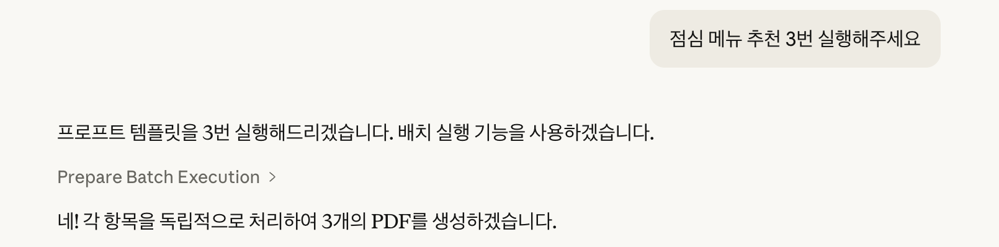
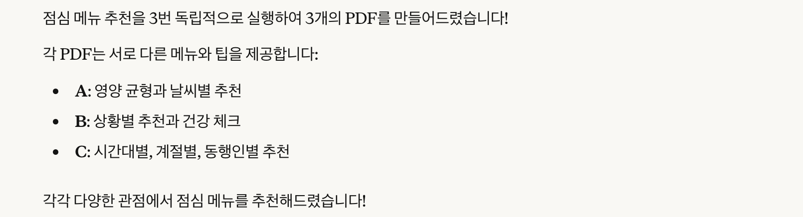
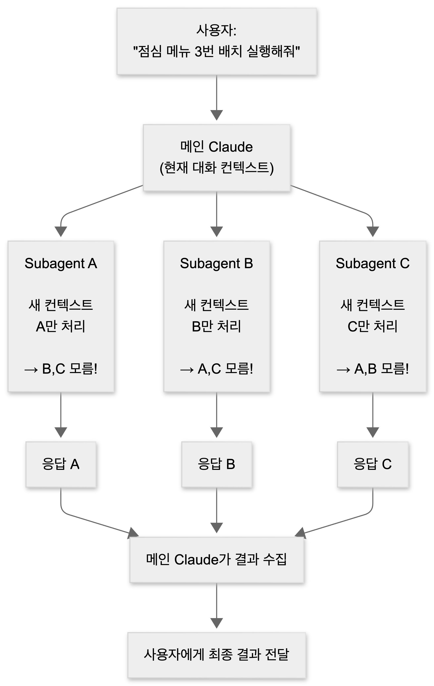

<div align="center">

<!-- 이미지 -->

# 프로프트 (Propt)

**한 번의 프롬프팅으로 여러 개의 답변을 얻으세요**

[](https://www.youtube.com/watch?v=Ip2T3xFEeJY)

[프로프트 사용해보기](https://www.propt.site/) | [프론트엔드 레포지토리](https://github.com/HwangGoeun/propt-frontend) | [백엔드 레포지토리](https://github.com/HwangGoeun/propt-backend)
</div>

<br>

## 목차

- [기술 스택](#기술-스택)
  - [Frontend](#frontend)
  - [Backend](#backend)
- [Challenges](#challenges)
  - [AI Agent ↔ MCP ↔ Web 간 사용자 인증 절차](#ai-agent--mcp--web-간-사용자-인증-절차)
    - [표준 OAuth 방식 사용 불가능 문제](#표준-oauth-방식-사용-불가능-문제)
    - [OTP로부터 힌트를 얻다](#otp로부터-힌트를-얻다)
    - [또 다른 벽, 게스트 로그인](#또-다른-벽-게스트-로그인)
    - [코드 입력 후 자동 리다이렉트](#코드-입력-후-자동-리다이렉트)
  - [배치 실행](#배치-실행)
    - [첫 번째 시도: 프롬프팅을 이용한 컨텍스트 분리](#첫-번째-시도-프롬프팅을-이용한-컨텍스트-분리)
    - [두 번째 시도: Claude Code의 Task 도구 사용하기](#두-번째-시도-claude-code의-task-도구-사용하기)
    - [Claude 내장 기능을 사용한다면, Propt의 가치는 무엇일까?](#claude-내장-기능을-사용한다면-propt의-가치는-무엇일까)
- [프로젝트 소감](#프로젝트-소감)

<br>
<br>

# 기술 스택

## Frontend

| 분류 | 기술 |
|------|------|
| **Framework** | React 19 |
| **Language** | TypeScript 5.9 |
| **Build Tool** | Vite 7 |
| **Styling** | Tailwind CSS 4 |
| **State Management** | Zustand, TanStack Query |
| **UI Components** | Radix UI, Lucide React |
| **Routing** | React Router 7 |
| **HTTP Client** | Axios |
| **Testing** | Vitest, Testing Library |
| **Code Quality** | ESLint, Husky |

<br>

## Backend

| 분류 | 기술 |
|------|------|
| **Framework** | NestJS 11 |
| **Language** | TypeScript 5.7 |
| **Database** | Prisma 6 |
| **Authentication** | Passport, JWT, Google OAuth 2.0 |
| **Validation** | class-validator, Zod |
| **API Documentation** | Swagger |
| **MCP** | Model Context Protocol SDK |
| **Testing** | Jest, Supertest |
| **Code Quality** | ESLint, Prettier, Husky |

<br>

---
<br>

# Challenges
## AI Agent ↔ MCP ↔ Web 간 사용자 인증 절차
프로프트는 웹에서 작성해놓은 프롬프트를 AI 에이전트에서 사용할 수 있도록 해주는 MCP입니다.
따라서, 사용자가 작성한 프롬프트만 사용할 수 있도록 하기 위해 MCP에서도 로그인과 같은 인증 과정을 거쳐야 합니다.

### 표준 OAuth 방식 사용 불가능 문제

**CLI 환경에서의 OAuth 시도 (문제 상황)**


처음에는 OAuth를 이용해 사용자 인증을 진행하려고 했습니다. 그러나 표준 OAuth는 `redirect_uri`를 통해 인증 결과를 전달받는데, Claude Code와 같은 CLI 환경에서는 웹 서버가 존재하지 않아 결과를 전달 받을 수 없었습니다.

<br>

### OTP로부터 힌트를 얻다
문자나 카카오톡을 통해 얻은 6자리 인증 번호를 입력해 본인 인증을 하는 방식은 우리에게 매우 익숙한 방식입니다.
'MCP가 리다이렉션 링크를 사용할 수 없다면, OTP 방식을 적용해보면 어떨까?' 하는 생각이 스쳤어요. OTP는 리다이렉션 링크도 필요없고, 6자리 숫자만 입력하면 되니까요.

**OTP vs API**

같이 고민했던 방법 중에는 API 키를 제공하는 방식이 있었어요. 하지만 사용자 경험 상 API키는 길이가 길기 때문에 오타 발생 가능성도 있고, 프로그램을 사용하는 첫 입구부터 '긴 길이의 텍스트를 정확하게 입력해야 한다'는 부담을 주고 싶지 않았어요.

**OTP 발급 시 0, O, 1, I를 제외했습니다**

코드 복사 버튼을 제공하고 있긴 하지만, 사용자가 직접 입력해야 하는 상황을 고려하여, 헷갈릴 수 있는 문자 4개는 제외하고 디바이스 코드를 생성하였습니다.

<br>

### 또 다른 벽, 게스트 로그인
기능을 구현하는 과정에서 가장 어려웠던 것은 게스트 로그인 기능을 구현하는 것이었습니다. '그냥 일회용 임시 계정 만들면 되는거 아니야?' 했지만, 생각보다 훨씬 어려웠습니다.

로그인을 해야하는 통로가 두 개였기 때문인데요,
- MCP → Web
- Web → MCP

게스트 로그인의 경우, 사용자가 어느 경로로 프로프트 서비스를 시작할지 알 수 없어 어느 경로에서 게스트 로그인을 시도하든 새로운 계정을 생성하도록 로직을 작성했었습니다.

그렇기 때문에 MCP에서 로그인을 시도하여 인증번호-임시 계정 간의 매핑을 하더라도, 웹 페이지에 접속했을 때 게스트 로그인 버튼을 클릭을 하면 다시 새로운 게스트 로그인 계정이 생성되어 같은 계정을 사용할 수 없었습니다.

이를 해결하기 위해 각 로그인 통로 별 다른 방법으로 로그인을 시도하도록 코드를 작성했습니다.

<br>

#### 1. MCP → Web (MCP에서 먼저 로그인하는 경우)
<details>
<summary>시퀀스 다이어그램 이미지</summary>

</details>

<br>

기존에는 state=mcp인 경우 디바이스 코드만 반환하고 쿠키를 설정하지 않았습니다. 그래서 MCP는 로그인되지만 웹은 로그인이 되었다는 것을 알 수 있는 방법이 없었습니다.

해결책으로 MCP 게스트 로그인 시에도 쿠키를 설정하도록 변경했습니다. 이제 POST `/auth/guest { state: 'mcp' }`를 호출하면 디바이스 코드를 반환하면서 동시에 브라우저에 쿠키도 설정합니다. 사용자가 MCP에 코드를 입력하면 MCP는 토큰으로 인증되고, 웹은 쿠키로 인증되어 같은 계정을 사용하게 됩니다.

<br>

#### 2. Web → MCP (Web에서 먼저 로그인하는 경우)

<details>
<summary>시퀀스 다이어그램 이미지</summary>

</details>

<br>

웹 페이지에서 이미 게스트 로그인을 한 상태에서 `state=mcp`로 접근하면, 웹 브라우저는 쿠키 보유 여부를 확인한 뒤 새 계정을 생성하지 않고 기존 유저의 디바이스 코드를 발급하도록 했습니다. 사용자가 발급된 코드를 MCP에 입력하면 웹과 동일한 계정으로 MCP가 인증됩니다.

<br>

### 코드 입력 후 자동 리다이렉트

사용자가 MCP에 코드를 입력한 뒤, 입력 확인 버튼을 누르면 템플릿 수정 페이지로 이동하도록 했습니다.

<br>

#### 폴링을 고려하긴 했습니다만...🤔
폴링 방식을 사용하면 사용자가 인증 코드를 입력하자마자 템플릿 페이지로 자동 리다이렉트가 되기 때문에, 사용자 경험이 매우 좋을 것이라는 생각이 들었습니다.

하지만 서버 부하 가능성에 대해 고민했을 때, 수동으로 확인 버튼을 누르는 방향이 적합하다고 판단했습니다.

폴링 간격을 2초로 설정했다고 가정한다면,
1명의 사용자:
- 코드 입력까지 평균 대기 시간: 30초
- 분당 요청 수: 30요청/분 (60초 ÷ 2초)
- 코드 페이지에 머무는 동안: 15회 요청

동시 접속자 수에 따른 분당 요청 수는 다음과 같은 결과가 나오게 됩니다 😲

| 동시 접속자 | 분당 요청 수 | 시간당 요청 수 |
| --- | --- | --- |
| 10명 | 300회 | 18,000회 |
| 100명 | 3,000회 | 180,000회 |
| 1,000명 | 30,000회 | 1,800,000회 |

코드 만료 시간(3분) 동안 최대 90회의 요청을 받는데, 사용자가 코드 페이지를 열어두고 다른 작업을 할 경우 불필요한 요청이 계속 발생하게 됩니다.
또한 매 요청마다 DB 조회를 해야 하기 때문에, 동시 접속자 100명 기준 분당 3,000회 DB 조회라는 비용이 발생하게 됩니다.

프로프트에서 채택한 버튼 + 상태 확인 방식은 사용자가 직접 '완료' 시점을 알려주기 때문에 불필요한 요청이 없고, 요청 횟수 또한 평균 1~2회이기 때문에 폴링 방식 대비 요청 횟수가 95%나 감소하는 효과를 얻을 수 있었습니다!

---
<br>

## 배치 실행
프로프트는 같은 프롬프트를 여러 번 실행했을 때, 이전 프로프트의 결과값이 이후 프롬프트의 결과값에 영향을 끼치는 문제를 해결하고자 했습니다.
예를 들어서, 학생 A, B, C의 보고서 평가를 요구하는 프롬프트를 작성한다고 했을 때, 프롬프트의 결과물로 `'A 학생의 보고서와 달리...'`와 같이 이전 결과물과 연관되는 답변이 나오지 않기를 원했습니다.

<br>

### 첫 번째 시도: 프롬프팅을 이용한 컨텍스트 분리

기존에는 다음과 같이 프롬프트에 instruction을 추가하여 컨텍스트 분리를 시도했습니다.

```
## 처리 방식
각 항목을 **독립적으로** 처리해주세요.

**핵심 원칙:**
- 각 항목은 별개의 요청으로 취급
- 해당 항목의 내용만을 기반으로 응답 생성
- 항목 간 참조나 비교 없이 개별 처리

**주의사항:**
- 다른 항목의 내용을 언급하지 않음
- "다른 항목과 달리", "앞선 내용처럼" 등의 표현 사용 금지
- 각 응답은 해당 항목만 보고 작성한 것처럼 구성
```

그 결과, 아래의 결과처럼 실제로 컨텍스트 분리에 성공한 듯 했습니다.

|전|후|
|---|---|
|||

(마지막 요약에서 지원자 간 비교 내용이 없는 것을 확인할 수 있습니다.)

<details>
<summary>점심 메뉴 추천 프롬프트 배치 실행 결과</summary>


</details>

<br>

하지만 '점심 메뉴 추천'과 같이 평범한 프롬프트를 배치 실행을 했을 때, '상황별로 다양하게 메뉴 추천을 해준다'는 답변을 얻었습니다. '다양하게'라는 것은 프롬프트의 결과값이 겹치지 않도록 하겠다는 뜻인데, 그러기 위해서는 앞선 프롬프트 실행 결과값을 참조해야 하고, 이는 각 프롬프트 실행의 결과값이 앞선 프롬프트 실행 결과값에 영향을 받는다는 것을 의미했습니다.

프롬프트에 instruction을 추가하여 컨텍스트 분리를 시도했던 것은, 실제로는 분리가 되지 않고 있었습니다.
그저 instruction을 따라서 결과물을 작성하니, 컨텍스트 분리가 된 것 처럼 보였던 것 뿐이었습니다.

<br>

#### LLM은 자기회귀적(Autoregressive) 모델이다
LLM은 텍스트를 생성할 때, 이전에 생성된 모든 텍스트를 다음 단어 예측의 근거로 사용합니다.

단일 프롬프트 내에서 `[A]`, `[B]`와 같은 식으로 답변을 생성하게 될 경우, 이미 다음 답변 생성 전 `[A]`, `[B]`는 LLM에게 과거의 문맥이 되어버리는 것입니다.

<br>

#### LLM은 같은 단어의 중복을 피하려고 한다
논문 [Closing the Curious Case of Neural Text Degeneration](https://proceedings.iclr.cc/paper_files/paper/2024/file/34899013589ef41aea4d7b2f0ef310c1-Paper-Conference.pdf)을 보면 탐욕적 디코딩(greedy decoding)이라는 표현이 나옵니다.

탐욕적 디코딩이란, LLM이 문장을 생성할 때 확률이 높은 단어를 우선적으로 말하는 것을 의미합니다. 탐욕적 디코딩은 같은 단어를 계속 반복하는 퇴행(degeration) 문제를 발생시킬 수 있어요.

예를 들어서, 문장에서 반복적으로 등장하는 단어가 있다면, 해당 단어의 확률은 계속해서 높아지며 해당 단어만 출력하는 루프에 빠지게 됩니다.

<br>

퇴행 문제를 해결하기 위해서, truncation sampling이라는 것을 사용합니다. 단순히 가장 확률이 높은 단어를 선택하는 것이 아니라, 확률이 높은 단어들의 후보군을 만든 뒤 후보군 중에서 단어를 랜덤으로 선택하는 식으로 문장을 생성하고 있어요.

<br>

#### 따라서, 프롬프팅을 이용한 컨텍스트 분리는 불가능합니다. 🥲
아무리 프롬프팅을 통해 컨텍스트 분리나 별개의 요청 취급을 요청하더라도, LLM은 답변 생성 즉시 이전의 답변을 참고하여 다음 컨텍스트에 반영하기 때문에, 이론상 컨텍스트 분리는 불가능합니다.

물론 위에 첨부한 캡처 화면처럼, 컨텍스트 분리가 되는 것 '처럼' 보이게 할 수는 있지만, 결국 근본적으로 컨텍스트 분리가 되는 것은 아닌거죠.

<br>

### 두 번째 시도: Claude Code의 Task 도구 사용하기
Claude Code에는 Task라는 도구가 있습니다. 이 도구는 새로운 [subagent](https://code.claude.com/docs/en/sub-agents)를 생성해서 작업을 위임하는데요, 각 subagent는 독립된 컨텍스트를 가지게 됩니다!

따라서, '점심 메뉴 3번 배치 실행해줘'라는 명령어를 입력한다면, 각 프롬프트는 독립된 환경에서 실행이 가능하다는 것이지요.

<details>
<summary>Subagent 동작 원리</summary>

</details>

<br>

별도의 API 호출이 필요없기 때문에, API 호출 비용 0원으로 독립된 컨텍스트에서 프롬프트 실행이 가능했습니다.

단점이라면 subagent는 Claude Code에서만 지원되는 기능이기 때문에, Claude Desktop이나 다른 AI agent에서는 사용이 불가능하다는 것이었어요.

하지만 컨텍스트 분리를 위한 다른 옵션들과 비교해보았을 때,
- 백엔드에서 직접 Claude API 호출하는 것은 배치 실행 횟수만큼의 API 호출 비용 발생했기에 비용 부담이 컸고,
- 무료 로컬 LLM 모델을 사용하는 것은 Claude 및 다른 대형 LLM 모델에 비해 성능이 낮아 MCP로 만들 이유가 없다고 판단했습니다.

<br>

### Claude 내장 기능을 사용한다면, Propt의 가치는 무엇일까?
Claude Code의 subagent 기능을 사용하기로 결정하니, 과연 Propt의 가치는 무엇일까 고민이 되었어요.
이미 Claude에 있는 Headless 모드 사용 명령어를 실행하라는 코드를 한 줄 추가한 것 뿐이라는 생각이 들었거든요.

그래서 Claude 기존 배치 기능과 propt 배치 실행을 비교해보았습니다.

| 기능 | Headless 모드 (`claude -p`) | Message Batches API | propt 배치 실행 |
|------|----------------------------|---------------------|-----------------|
| **대상 사용자** | 개발자/파워유저 | 개발자 | 일반 사용자 |
| **사용 방법** | 터미널 명령어 직접 입력 | API 코드 작성 | MCP 도구로 대화 |
| **템플릿 저장/재사용** | ❌ | ❌ | ✅ |
| **변수 자동 치환** | ❌ 수동 작성 | ❌ 수동 구성 | ✅ `{변수명}` 자동 치환 |
| **웹 UI** | ❌ | ❌ | ✅ propt.site |

Propt는 Headless 모드를 쉽게 사용할 수 있도록 도와줍니다.

기술적 기반은 동일하지만, 템플릿 관리 + 변수 치환 + 비개발자 UX를 제공하는 것을 차별점이라고 할 수 있겠습니다.

---
<br>

# 프로젝트 소감
기존 코드를 작성할 때에는 정해진 로직에 맞추어 정해진 답변이 나오는 코드를 작성해왔습니다.
하지만 이번 Propt 프로젝트의 경우, 코드를 작성한다기보다는 AI agent를 이해하고 프롬프팅을 어떻게 해야하느냐에 대한 고민을 더 해야 했습니다.
그와 동시에 MCP라는 중간 연결 다리를 통해 AI agent - 웹이라는 두 가지 환경에서 서비스를 제공하고 있어서, 각 플랫폼 간 사용자 경험을 자연스럽게 연결시키려는 고민도 많이 했습니다.

단순히 '안된다', 혹은 '여러 시도를 해봐야지'보다는, 프롬프팅 관련 공식 문서나 논문을 찾아보며 LLM의 원리를 이해하고 활용하려는 시도가 원하는 결과물을 만들어 내는 데에 도움을 줬던 것 같습니다.
