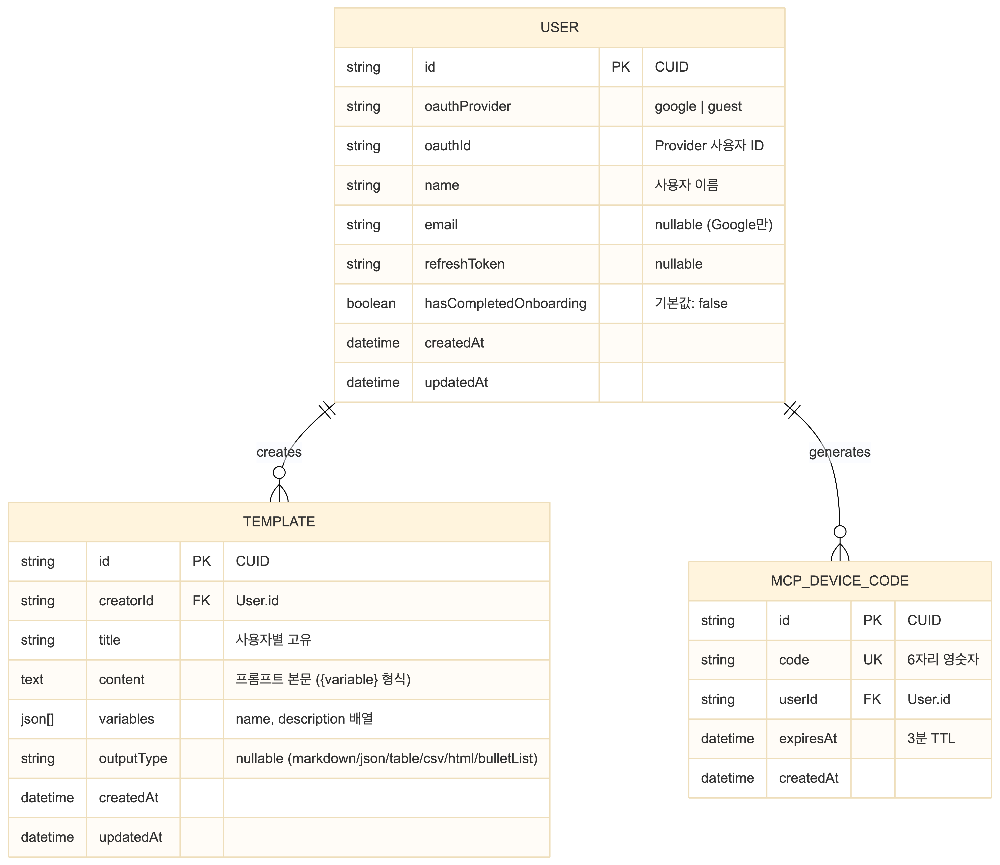

# ERD / 아키텍처

## 목차

- [ERD](#erd)
- [테이블 상세](#테이블-상세)
- [시스템 아키텍처](#시스템-아키텍처)

---

## ERD

---

## 테이블 상세

### User

- `@@unique([oauthProvider, oauthId])` — OAuth 제공자별 고유 사용자
- CASCADE: 삭제 시 Template, McpDeviceCode 함께 삭제

| 컬럼 | 타입 | 설명 |
|------|------|------|
| id | string (PK) | CUID |
| oauthProvider | string | `google` \| `guest` |
| oauthId | string | Provider 사용자 ID |
| name | string | 사용자 이름 |
| email | string? | nullable (Google만) |
| refreshToken | string? | nullable |
| hasCompletedOnboarding | boolean | 기본값: false |
| createdAt | datetime | |
| updatedAt | datetime | |

### Template

- `@@unique([creatorId, title])` — 사용자별 제목 중복 방지

| 컬럼 | 타입 | 설명 |
|------|------|------|
| id | string (PK) | CUID |
| creatorId | string (FK) | User.id |
| title | string | 사용자별 고유 |
| content | text | 프롬프트 본문 (`{variable}` 형식) |
| variables | json[] | `[{ "name": "keyword", "description": "검색어" }]` |
| outputType | string? | markdown, json, table, csv, html, bulletList |
| createdAt | datetime | |
| updatedAt | datetime | |

### McpDeviceCode

- `code`: 6자리 (0, 1, I, O 제외하여 혼동 방지)
- TTL 3분 후 만료

| 컬럼 | 타입 | 설명 |
|------|------|------|
| id | string (PK) | CUID |
| code | string (UK) | 6자리 영숫자 |
| userId | string (FK) | User.id |
| expiresAt | datetime | 3분 TTL |
| createdAt | datetime | |

---

## 시스템 아키텍처

